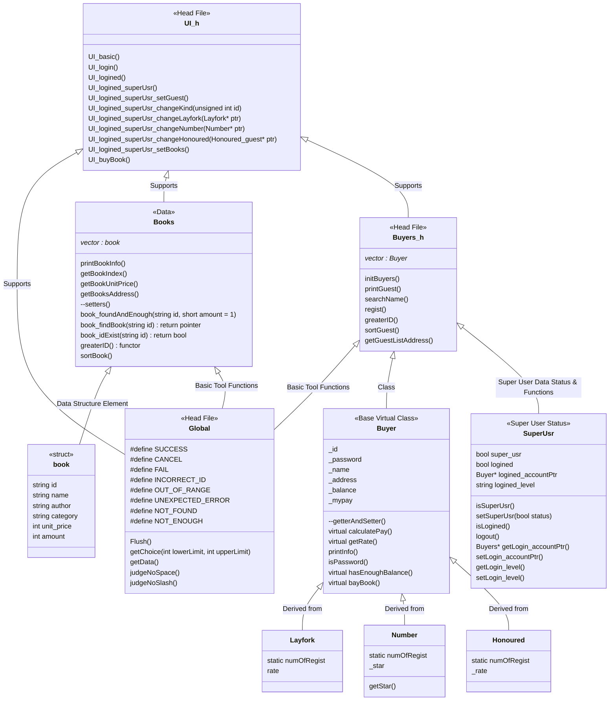
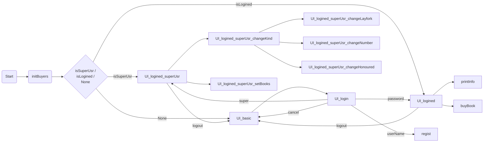

# Book Purchase System

> A project written for a course in the College of Communications

## Note

View question in [Question](./Question)

## Project Structure

<b><i>Schematic Diagram of Project Structure</i></b>

## Running Progress

<b><i>Schematic Diagram of Running Progress </i></b>

## Learned & Used Interesting Skills

1. global `static` variables are only usable in current file
2. `greaterID()` functor
3. `static_cast<>()` & `dynamic_cast<>()`
4. *<u>undefined reference to</u>* & *<u>multiple definition of</u>*
